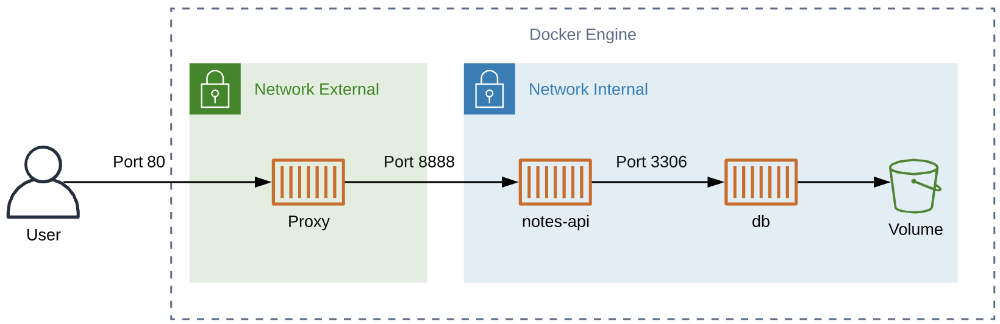
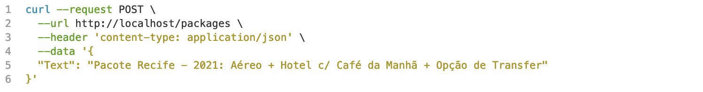
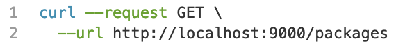
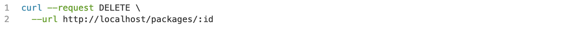

#  Desafio Delta - João Ferreira

O projeto consiste em uma API implementada com Node.js​ + MySQL​ para criação e consulta de pacotes.
Você deve:

## Diagrama da infraestrutura do projeto



## Requisitos

- Git
- Docker Engine
- Docker Compose
- Kubernetes (ex. minikube)

## Modo de execução local (Compose)

```
  # Clone o repositório

  $ git clone https://github.com/ojaoferreira/challenge-delta.git

  # Acesse o diretório do projeto

  $ cd ./challenge-delta/

  # Contrua as imagens

  $ docker-compose build

  # Execute o compose (O parametro -d faz a aplicação executar em backgroud)

  $ docker-compose up -d
```

## Modo de execução kubernetes (kubectl)

```
  # Clone o repositório

  $ git clone https://github.com/ojaoferreira/challenge-delta.git

  # Acesse o diretório do projeto

  $ cd ./challenge-delta/

  # Crie os recursos Kubernetes

  $ kubectl apply -f .k8s/

  # Acesse aplicação pelo serviço NodePort

  $ minikube service challenge-delta-proxy -n challenge-delta
```

## Documentação da API

- Cria um pacote


- Lista os pacotes cadastrados


- Deleta um pacote pelo ID do pacote
