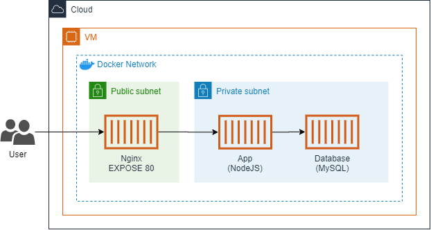

# challenge-delta


Exemplo de projeto que segue boas práticas de como trabalhar com container e CI utilizando o GitHub Action.



## 🐱‍💻 Requisitos

Vocês precisará das seguintes aplicações para executar o ambiente:

- docker
- docker-compose
- git

```bash
# Se você estiver utilizando o Ubuntu 18.04 ou 20.04,
# execute os comandos abaixo.
sudo apt-get update
sudo apt-get install -y \
	docker.io docker-compose git
```

## 🐳 Como construir e executar localmente (desenvolvimento)

```bash
# Clone o repositório e entre no diretório
git clone https://github.com/thenets/challenge-delta.git
cd ./challenge-delta/

# Construa as imagens
docker-compose build

# Execute o docker-compose
docker-compose up
```


## ☸ Como executar no Kubernetes

O manifesto `./k8s/dedsec-app.yml` possui todas as informações que você precisará para levantar a aplicação. Será criado um novo `Namespace`, `ConfigMap`, `Deployment` e `Service`.

```bash
kubectl apply -f ./k8s/dedsec-app.yml
```


## Como testar a aplicação

Exemplo de como acessar a aplicação, considerando que o ambiente foi criado com o `docker-compose.yml`:

```bash
# Adicionar `offer`
curl -X POST \
	-H "Content-Type: application/x-www-form-urlencoded" \
	-d "Watch Dogs 2" \
	http://localhost:3000/packages/
curl -X POST \
	-H "Content-Type: application/x-www-form-urlencoded" \
	-d "The Legend of Zelda - The Minish Cap" \
	http://localhost:3000/packages/

# Listar `offers`
curl http://localhost:3000/packages/

# Remover `offer`
curl -X DELETE http://localhost:3000/packages/1

# Listar `offers`
curl http://localhost:3000/packages/
```
