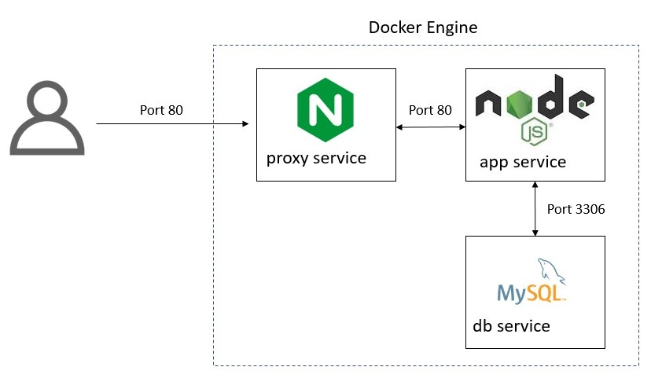
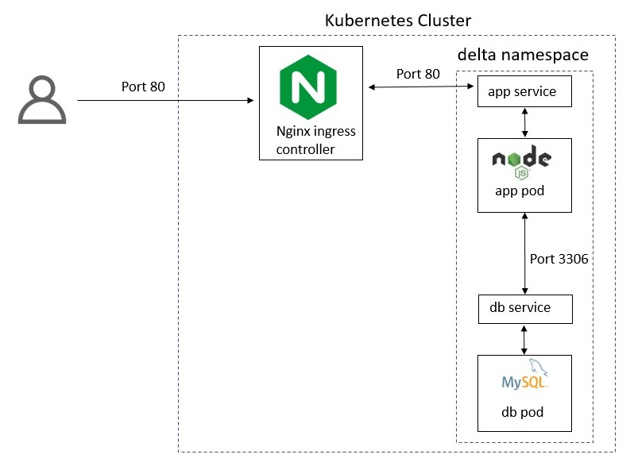

#  Desafio Delta - Julliano Gonçalves

## Overview

This is a simple API project implemented in Nodejs that handles Travel Packages.
The project is architected in a backend with Nodejs + Mysql. In front of the API we have an Nginx doing a reverse proxy.

### Structure

```bash
.
├── .db.secrets # Secrets used by the database service and API service.
├── .dockerignore
├── .editorconfig
├── .env # Variables to use in docker-compose.yaml and automation.sh
├── .gitignore
├── README.md
├── automation.sh
├── diagram-docker.jpg
├── diagram-kubernetes.jpg
├── docker # Directory containing all the artifacts needed to build and initialize the docker container.
│   ├── app.dockerfile
│   ├── db.dockerfile
│   ├── docker-compose.yaml
│   ├── mysql
│   │   └── database_schema.sql
│   ├── nginx
│   │   └── nginx.conf
│   └── proxy.dockerfile
├── k8s # Directory with artifacts for deployment of services in Kubernetes.
│   ├── app.yaml
│   ├── db.yaml
│   └── ingress.yaml
├── pull-request.txt
└── src
    ├── package.json
    └── server.js
```

### Diagrams

The diagram below shows the structure of the project implemented in Native Docker:

<p align="center">
  
</p>


The diagram below shows the structure of the project implemented in Kubernetes (minikube):

<p align="center">
  
</p>


## Setup

* Windows 10 (Nothing prevents it from running on Linux or MacOS. Just ensure that you install the correct packages.)
* Oracle VM VirtualBox Manager 5.2.22

## Notes
* The project uses a VM with docker server installed. This VM is started by the Minikube. It was chosen to do this in order to simplify the basic setup of the environment.
* The script [automation.sh](./automation.sh) provide functionality to implement the project in Native Docker or Kubernetes.
* The script [automation.sh](./automation.sh) also seeks to guarantee the existence of some necessary packages for the project: docker-compose, minikube, kubectl, jq.
* When the deployment is performed by docker-compose, an Nginx is deployed as a proxy. This proxy is binding from port **80** from the host to the container.
* When the deployment is carried out in Kubernetes, the ingress from the Minikube is enabled. This is also linked to port **80** from the host to the container. Therefore, a mechanism to enable and disable Kubernetes Ingress was implemented.

## Deployments

### In Native Docker using docker-compose:

```shell
./automation.sh startDockerCompose
```
This command is responsible for:

* Download the packages needed to execute the project (docker-compose, jq, minukube)
* Create all necessary images: ([hurbcom/app](./docker/app.dockerfile), [hurbcom/db](./docker/db.dockerfile), [hurbcom/proxy](./docker/proxy.dockerfile))
* Start services with docker-compose (It is not running in the background, by design. To run in the backgroup, simply inform the `-d` flag).

### In Kubernetes(Minikube) using kubectl:

```shell
./automation.sh startKube
```
This command is responsible for:

* Download the packages needed to execute the project (minukube, kubectl, jq)
* Create all necessary images: ([hurbcom/app](./docker/app.dockerfile), [hurbcom/db](./docker/db.dockerfile), [hurbcom/proxy](./docker/proxy.dockerfile))
* Start services with kubectl.
  - A namepsace named `delta` is created;
  - A template of kubernete secrets is created from the file [.db.secrets](./.db.secrets);
  - Apply the kubernetes manifests ([app](k8s/app.yaml), [db](k8s/db.yaml), [ingress](k8s/ingress.yaml))
* In the [db](k8s/db.yaml) manifest, a volume for persisting the database is also created.

## Usage

Some commands to interact with the API.

#### Create Package
  ```shell
  ./automation.sh createPackage "New package"
  ```

#### Delete Package
  ```shell
  ./automation.sh deletePackage "id"
  ```

#### List Packages
  ```shell
  ./automation.sh listPackage
  ```

## Notes

- There are problems with the security of the service.
    * Database passwords are versioned in the repository. The ideal is to integrate kubernetes with an external secret service, such as Azure Key Vault, Amazon Key. I would use something like the [Secret Store CSI Driver](https://github.com/kubernetes-sigs/secrets-store-csi-driver).
