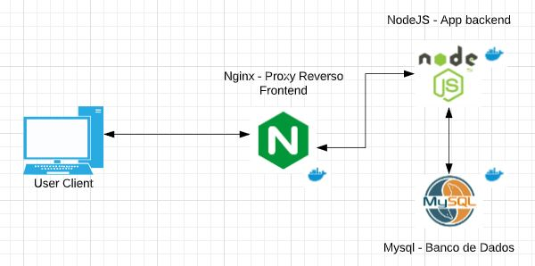
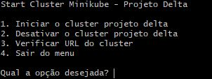

#  Resolução do Desafio Delta - Vitor Alves

Fiz a resolução do desafio com as seguintes opções:

- Rodando somente com Dockerfile 
- Utilizando docker-compose
- Cluster utilizando Minikube

### Diagrama

  

### Subir o ambiente usando Dockerfile
- Utilizar SO Linux(Ambiente foi testado com Ubuntu 18)
- Clonar o repositório
- Na pasta raiz do repositório rodar o script painel_docker.sh
   - Escolher as opções de acordo com a ação:
 

  
 

 ### Subir o ambiente usando Compose
 - Utilizar SO Linux(Ambiente foi testado com Ubuntu 18)
 - Clonar o repositório
 - Na pasta raiz do repositório rodar o script painel_compose.sh
    - Escolher as opções de acordo com a ação:
 

  
 
   

### Subir o ambiente usando Minikube
- Utilizar SO Linux(Ambiente foi testado com Ubuntu 18)
- Ter instalado o minikube(Foi testado na versão 1.9.2)
- Subir o ambiente com permissão elevada(root ou administrator caso rode no windows)
- Na pasta ./k8s do repositório rodar o script painel_k8s.sh
    - Escolher as opções de acordo com a ação:
 
 

  
 

 ## Criando e Removendo pacotes

 ### Ambiente Dockerfile e Compose
  - Acessar a pasta raiz do repositório e rodar o script painel_packages.sh
      - Escolher as opções de acordo com a ação:
 

  
 
    

### Ambiente Minikube
  - Acessar a pasta ./k8s do repositório e rodar o script painel_packages.sh
      - Escolher as opções de acordo com a ação:
 

  
 

