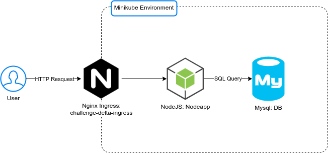

#  Objetivo: Desafio Delta

Como DevOps voce vai desenhar e implementar arquitetura e sistemas relacionados a build, release, deploy e configurações de aplicações, assim como manter-se atualizado com as tecnologias de mercado.

Este estudo de caso tem como objetivo testar as habilidades relevantes para esta função.

O projeto consiste em uma API implementada com Node.js​ + MySQL​ para criação e consulta de pacotes, abaixo estão os detalhes necessário para inicialização, deploy e utilização.

## Diagrama da infraestrutura
-   Criar o diagrama de toda a infraestrutura do projeto em questão (Ingress, backend e database );

  

## Arvore dos directorios
.
├── app
│   ├── db
│   │   └── database_schema.sql
│   └── src
│       ├── package.json
│       └── server.js
├── automate
│   ├── docker
│   │   ├── db
│   │   │   └── Dockerfile
│   │   └── nodeapp
│   │       └── Dockerfile
│   └── k8s
│       ├── db.yml
│       ├── ingress.yml
│       ├── namespace.yml
│       └── nodeapp.yml
├── docs
│   ├── ca.jpg
│   └── hurb.png
├── Makefile
├── pull-request.txt
└── README.md

## Requisitos
- Estar em um ambiente Linux; (De preferencia Ubuntu).
- Nesse ambiente devem estar instalado os pacotes "Make" e "Curl", pois são utilizados na automação dos comandos restantes.

## Inicialização do projeto
-   Para executar o codigo é preciso rodar apenas rodar os seguintes comandos:
    -   `git clone <Este repository>`

    -   Executar o comando para instalar dependências:
        `make package`

    -   Comando para iniciar o cluster e iniciar a aplicação
        `make deploy`

## Utilização da API
- Via automação:
    - Comando para listar os pacotes:
      `make list`
    - Comando para criar um pacotes:
      `make create package=<Nome do pacote>`
    - Comando para deletar um pacotes:
      `make delete id=<ID do pacote>`
- Via curl
    

## Dúvidas
O comandos disponiveis na automação podem ser consultados da seguinte forma:
    - `make help`

Quaisquer dúvidas que você venha a ter, consulte as [_issues_](https://github.com/HurbCom/challenge-delta/issues) para ver se alguém já não a fez e caso você não ache sua resposta, abra você mesmo uma nova issue!

Boa sorte e boa viagem! ;)

  

