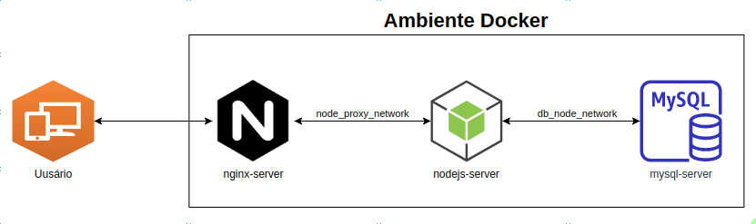
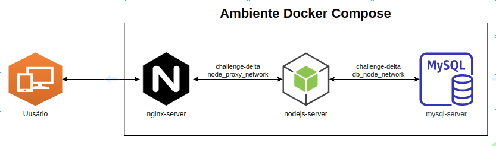
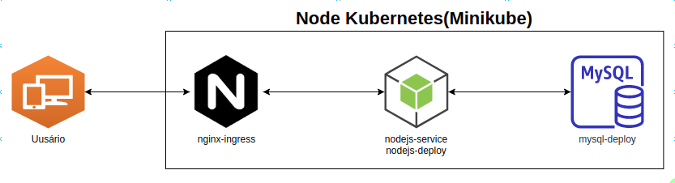

#  Desafio Delta

Desafio executado utilizando Docker, Docker Compose e Kubernetes(Minikube):
- Iniciando o ambiente com o Docker:
    -   Execute o comando `git clone https://github.com/fmottamendes/challenge-delta` para clonar o repositório.
    -   Execute o comando `cd challenge-delta; bash instala_docker_e_compose_centos.sh` para instalar o pacote docker e docker-compose(CentOS 8)
    -   Execute o comando `bash ambiente_docker.sh start`, para iniciar os containers.

  

    
- Iniciando o ambiente com o Docker Compose:
    -   Execute o comando `git clone https://github.com/fmottamendes/challenge-delta` para clonar o repositório.
    -   Execute o comando `bash instala_docker_e_compose_centos.sh` para instalar o pacote docker e docker-compose(CentOS 8)
    -   Execute o comando `docker-compose up -d`, para iniciar os containers

  

- Iniciando o ambiente com o Kubernetes(Minikube):
    -   Execute o comando `git clone https://github.com/fmottamendes/challenge-delta` para clonar o repositório.
    -   Execute o comando `cd challenge-delta;bash instala_minikube.sh` para instalar o Kubectl e Minikube(Requer Hypervisor, Virtualbox ou KVM)
    -   Execute o comando `bash ambiente_minikube.sh`, para iniciar os deploys, service e ingress no Kubernetes

  

  

